# Indian Banks

Structured, centralized data, including logos for all the Indian Banks, collected from official sources.

## Sponsorship & Contribution

If you or your organization uses this repository for bank related data, please consider sponsoring me. It has taken me hours of work to get high quality vectors right and source data from multiple places after a lot of manual verification.

As you can imagine, this is a time consuming effort and it would be amazing if you can [contribute](./CONTRIBUTING.md) to this repository.

## Current Status

- [ ] Vector Logos - In Progress
- [ ] Figuring out the base data structure - In Progress
  - Name
  - Logo
  - Symbol / Small Logo
  - Short Code
  - IFSC Prefix
  - Balance Check USSD Code
  - Website
  - Type : https://www.rbi.org.in/scripts/banklinks.aspx
- [ ] How to scrape names & other details from official websites.

## Bank Slugs

This table is auto-generated from [data/banks.json](./data/banks.json) and the contents of [assets/logos/](./assets/logos/) on every commit that touches either. To regenerate manually, run `pnpm run generate:readme`.

<!-- BANKS_TABLE_START -->
| Bank Name | Slug | Logo | Symbol |
| --- | --- | --- | --- |
| [Airtel Payments Bank](./assets/logos/airp/) | `airp` | <br/>`SVG` `PNG` | <br/>`SVG` `PNG` |
| [AU Small Finance Bank Limited](./assets/logos/aubl/) | `aubl` | 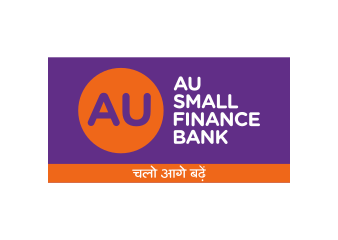<br/>`SVG` `PNG` | <br/>`SVG` `PNG` |
| [Bank of Baroda](./assets/logos/barb/) | `barb` | <br/>`SVG` `PNG` | <br/>`SVG` `PNG` |
| [Bandhan Bank](./assets/logos/bdbl/) | `bdbl` | <br/>`SVG` `PNG` | <br/>`SVG` `PNG` |
| [Bank of India](./assets/logos/bkid/) | `bkid` | 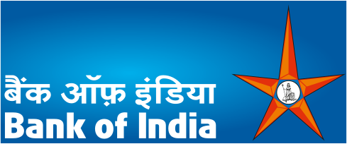<br/>`SVG` `PNG` | <br/>`SVG` `PNG` |
| [Central Bank of India](./assets/logos/cbin/) | `cbin` | <br/>`SVG` `PNG` | <br/>`SVG` `PNG` |
| [City Union Bank](./assets/logos/ciub/) | `ciub` | <br/>`SVG` `PNG` | <br/>`SVG` `PNG` |
| [Canara Bank](./assets/logos/cnrb/) | `cnrb` | <br/>`SVG` `PNG` | <br/>`SVG` `PNG` |
| [CSB Bank Limited](./assets/logos/csbk/) | `csbk` | <br/>`SVG` `PNG` | <br/>`SVG` `PNG` |
| [DCB Bank Limited](./assets/logos/dcbl/) | `dcbl` | <br/>`SVG` `PNG` | <br/>`SVG` `PNG` |
| [Dhanalakshmi Bank](./assets/logos/dlxb/) | `dlxb` | <br/>`SVG` `PNG` | <br/>`SVG` `PNG` |
| [ESAF Small Finance Bank](./assets/logos/esmf/) | `esmf` | 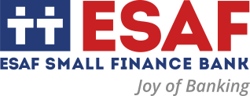<br/>`SVG` `PNG` | <br/>`SVG` `PNG` |
| [Federal Bank](./assets/logos/fdrl/) | `fdrl` | 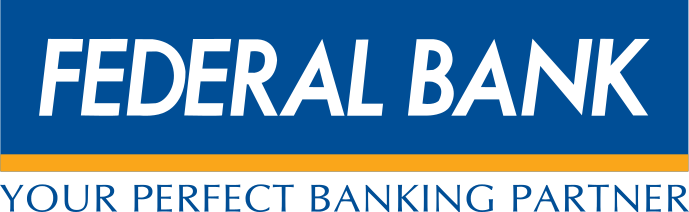<br/>`SVG` `PNG` | <br/>`SVG` `PNG` |
| [FINO Payments Bank](./assets/logos/fino/) | `fino` | <br/>`SVG` `PNG` | <br/>`SVG` `PNG` |
| [HDFC Bank](./assets/logos/hdfc/) | `hdfc` | <br/>`SVG` `PNG` | <br/>`SVG` `PNG` |
| [IDBI Bank](./assets/logos/ibkl/) | `ibkl` | <br/>`SVG` `PNG` | <br/>`SVG` `PNG` |
| [ICICI Bank Limited](./assets/logos/icic/) | `icic` | <br/>`SVG` `PNG` | <br/>`SVG` `PNG` |
| [IDFC First Bank Limited](./assets/logos/idfb/) | `idfb` | <br/>`SVG` `PNG` | <br/>`SVG` `PNG` |
| [Indian Bank](./assets/logos/idib/) | `idib` | 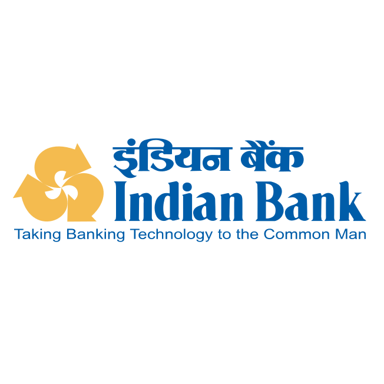<br/>`SVG` `PNG` | <br/>`SVG` `PNG` |
| [IndusInd Bank](./assets/logos/indb/) | `indb` | <br/>`SVG` `PNG` | <br/>`SVG` `PNG` |
| [Indian Overseas Bank](./assets/logos/ioba/) | `ioba` | <br/>`SVG` `PNG` | <br/>`SVG` `PNG` |
| [Jammu and Kashmir Bank](./assets/logos/jaka/) | `jaka` | <br/>`SVG` `PNG` | <br/>`SVG` `PNG` |
| [Jio Payments Bank](./assets/logos/jiop/) | `jiop` | <br/>`SVG` `PNG` | <br/>`SVG` `PNG` |
| [Karnataka Bank Limited](./assets/logos/karb/) | `karb` | <br/>`SVG` `PNG` | <br/>`SVG` `PNG` |
| [Kotak Mahindra Bank Limited](./assets/logos/kkbk/) | `kkbk` | <br/>`SVG` `PNG` | <br/>`SVG` `PNG` |
| [Karur Vysya Bank](./assets/logos/kvbl/) | `kvbl` | 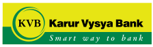<br/>`SVG` `PNG` | 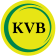<br/>`SVG` `PNG` |
| [Bank of Maharashtra](./assets/logos/mahb/) | `mahb` | <br/>`SVG` `PNG` | <br/>`SVG` `PNG` |
| [The Nainital Bank Limited](./assets/logos/ntbl/) | `ntbl` | 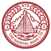<br/>`SVG` `PNG` | <br/>`SVG` `PNG` |
| [Punjab and Sind Bank](./assets/logos/psib/) | `psib` | 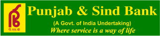<br/>`SVG` `PNG` | <br/>`SVG` `PNG` |
| [Punjab National Bank](./assets/logos/punb/) | `punb` | <br/>`SVG` `PNG` | <br/>`SVG` `PNG` |
| [Paytm Payments Bank](./assets/logos/pytm/) | `pytm` | <br/>`SVG` `PNG` | <br/>`SVG` `PNG` |
| [RBL Bank Limited](./assets/logos/ratn/) | `ratn` | <br/>`SVG` `PNG` | <br/>`SVG` `PNG` |
| [State Bank of India](./assets/logos/sbin/) | `sbin` | <br/>`SVG` `PNG` | <br/>`SVG` `PNG` |
| [Standard Chartered Bank](./assets/logos/scbl/) | `scbl` | 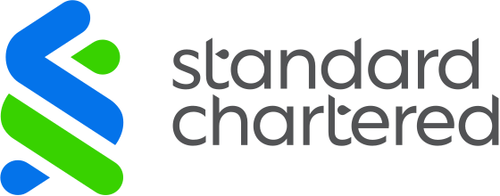<br/>`SVG` `PNG` | <br/>`SVG` `PNG` |
| [South Indian Bank](./assets/logos/sibl/) | `sibl` | <br/>`SVG` `PNG` | <br/>`SVG` `PNG` |
| [Tamilnad Mercantile Bank Limited](./assets/logos/tmbl/) | `tmbl` | 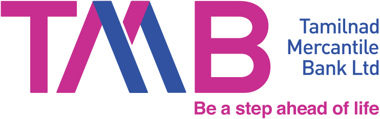<br/>`SVG` `PNG` | <br/>`SVG` `PNG` |
| [Union Bank of India](./assets/logos/ubin/) | `ubin` | <br/>`SVG` `PNG` | <br/>`SVG` `PNG` |
| [UCO Bank](./assets/logos/ucba/) | `ucba` | <br/>`SVG` `PNG` | <br/>`SVG` `PNG` |
| [Ujjivan Small Finance Bank Ltd](./assets/logos/ujvn/) | `ujvn` | <br/>`SVG` `PNG` | <br/>`SVG` `PNG` |
| [Axis Bank](./assets/logos/utib/) | `utib` | <br/>`SVG` `PNG` | <br/>`SVG` `PNG` |
| [Yes Bank](./assets/logos/yesb/) | `yesb` | <br/>`SVG` `PNG` | <br/>`SVG` `PNG` |
<!-- BANKS_TABLE_END -->

## Optimizing & Converting

Optimize SVGs (preserves `viewBox`):

```sh
pnpm install
pnpm run optimize
```

Convert SVGs to PNG or AVIF. By default, writes 1x PNGs alongside each SVG in `assets/logos/`:

```sh
pnpm run convert
```

We ship 1x PNGs alongside every SVG. If you need AVIF or higher-density variants, pass a format, scale factor, and output directory:

```sh
# 2x AVIFs into ./dist
pnpm run convert -- --format avif --scale 2 --out dist
```

**Flags**

| Flag              | Values       | Default           | Notes                                        |
| ----------------- | ------------ | ----------------- | -------------------------------------------- |
| `-f`, `--format`  | `png`, `avif`| `png`             |                                              |
| `-s`, `--scale`   | `1`, `2`, `3`| `1`               | 1x uses intrinsic SVG dimensions             |
| `-o`, `--out`     | any dir      | `assets/logos/`   | If omitted, overwrites files in the repo     |

Output is named `logo.png` at 1x, `logo@2x.png` at 2x, `logo@3x.png` at 3x (and the same pattern for AVIF).

## Contributors
<a href="https://github.com/praveenpuglia/indian-banks/graphs/contributors">
  
</a>

Made with [contrib.rocks](https://contrib.rocks).
